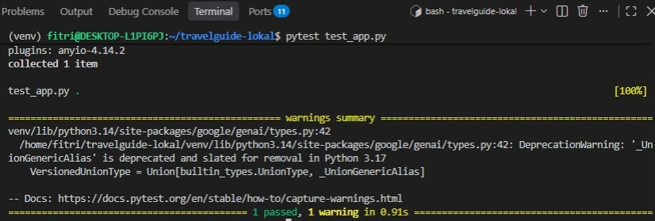

# ✈️ TravelGuideAI

## 💡 About the Project

TravelGuideAI is an AI-powered travel guide that helps users explore destinations and get personalized travel recommendations using Generative AI.

## 🌐 Deployment
Platform: DigitalOcean  
Server: Linux VPS  
Infrastructure as Code: Terraform  
Containerization: Docker & Docker Compose
Reverse Proxy: Nginx

## 🏗️ Infrastructure as Code
Terraform is used to manage the DigitalOcean Droplet infrastructure as code

## 📱 Features
- Travel Destination
- Destination Information
- AI Recommendation
- RAG

## 🛡️ Test Command
Test the application using
pytest test_app.py



## ⚛️ Tech Stack

### 🤖 AI
- Google Gemini API
- Retrieval-Augmented Generation (RAG)

### 🛠️ Development
- Python
- Flask
- HTML
- CSS
- JavaScript

### 🐳 DevOps
- Docker
- Docker Compose
- Nginx
- Terraform
- DigitalOcean
- Git
- GitHub
- Linux

### 🔄 CI/CD
- GitHub Actions

### 🛠️ Tools & Environment
- VS Code

## ✅ Requirements
Things you need to run TravelGuideAI
1. **Docker**
2. **Docker Compose**
3. **Google Gemini API Key**

## ☸️ Installation
Follow these steps to run TravelGuideAI locally

### 1. Clone the Repository
https://github.com/fitrimuslikhah/TravelGuideAI-RAG.git

### 2. Move to cloned Repository Folder
cd TravelGuideAI-RAG

### 3. Create the Environment File
Create a `.env` file in the project root
GEMINI_API_KEY=your_api_key

### 4. Build and Run the Application
Run the application using Docker Compose
docker compose up --build

### 5. Open the Application
Once the container is running, open:
```text
http://localhost:5000
```

### 6. Stop the Application
To stop the containers:
```bash
docker compose down
```


